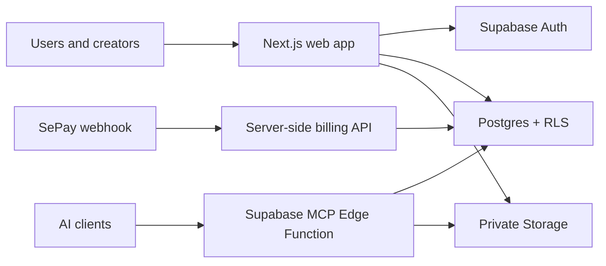

# OceanSkill

OceanSkill is a bilingual marketplace and delivery layer for AI-agent skills. It gives people one place to discover and organize skills, while giving agents a governed MCP interface for retrieving verified `SKILL.md` instructions and their supporting files.

The product is available in Vietnamese and English. It combines a public skill catalog, private creator uploads, collections, API-key management, usage tracking, and prepaid credits in one workflow.

> Vietnamese summary: OceanSkill là kho skill song ngữ dành cho AI agent, hỗ trợ khám phá, quản lý bộ sưu tập, kết nối MCP và kiểm soát quyền truy cập cũng như credit theo từng lần sử dụng.

## Why OceanSkill

Agent instructions are often copied between repositories, editors, and chat sessions without a consistent way to answer basic operational questions: Which version is active? Who may retrieve it? Has the stored file changed? How much did a call cost?

OceanSkill treats a skill as a managed resource rather than a loose prompt:

- users browse skills by category, author, rating, and usage ranking;
- creators publish private skills through an ownership-checked workflow;
- users group skills into personal collections or add curated platform collections;
- MCP clients retrieve only skills available to the key owner;
- paid retrievals reserve a credit, finalize it on success, and release it on failure;
- publish-time SHA-256 pins protect `SKILL.md` and reference files from silent storage changes.

## Product tour

### Marketplace

The localized marketplace exposes public metadata, categories, authors, reviews, compatibility information, and SEO-friendly skill pages. Public catalog data comes from Supabase; protected file content is not embedded into public pages.

### Dashboard

Authenticated users can manage their MCP keys, usage history, credits, private skills, and collections. Creator uploads remain private and are subject to ownership, file-size, content-scan, and available-slot checks.

### Collections

Personal collections can be created, updated, reordered, executed, or deleted by their owner. Platform collections are curated read-only sets: users can inspect them and add a copy to their own library, but cannot edit or delete the source collection.

### MCP delivery

An AI client connects to the Supabase Edge Function with an OceanSkill key (`nsk_...`). The function authenticates the key, checks ownership or library entitlement, enforces usage rules, then retrieves the pinned file from private Storage.

Charged tools use a reserve/finalize/release flow. Each retrieval has its own `requestId`; an exact successful replay is free for 10 minutes, while a different tool, skill version, or reference cannot reuse that identifier.

## MCP tools

| Tool | Purpose | Credit |
| --- | --- | ---: |
| `list_purchased_skills` | List enabled public skills and private skills owned by the caller | Free |
| `search_skills` | Search accessible skill metadata | Free |
| `get_skill_md` | Retrieve the verified current `SKILL.md` and available reference keys | 1 on success |
| `get_skill_reference` | Retrieve one verified supporting file; it cannot retrieve `SKILL.md` | 1 on success |
| `list_collections` | List platform collections and collections owned by the caller | Free |
| `add_collection_to_library` | Add an available collection and enable its skills | Free |
| `create_skill_collection` | Create a uniquely named personal collection | Free |
| `update_skill_collection` | Change metadata or skill membership in an owned collection | Free |
| `delete_skill_collection` | Delete an owned collection | Free |
| `execute_skill_collection` | Execute an owned collection in its defined skill order | Retrievals are charged when content is fetched |
| `toggle_skill` | Enable or disable a skill in the caller's library | Free |
| `get_usage_summary` | Return balance, current-month usage, and enabled-skill count | Free |

See [the MCP Edge Function reference](docs/mcp-edge-function.md) for the HTTP configuration, deployment command, and security model.

## Architecture



- **Web:** Next.js App Router, React, TypeScript, Tailwind CSS, and `next-intl`.
- **Data and identity:** Supabase Postgres, Row Level Security, and Auth with SSR-aware clients.
- **Skill files:** private Supabase Storage objects with version records and publish-time hashes.
- **Agent interface:** a Supabase Edge Function that implements MCP JSON-RPC over HTTP.
- **Billing:** server-only order and webhook routes backed by an append-oriented credit ledger.
- **Localization and SEO:** Vietnamese/English routes, localized metadata, canonical URLs, hreflang, sitemap, robots rules, and structured data.

More detail is available in [the architecture guide](docs/ARCHITECTURE.md) and [internationalization guide](docs/I18N.md).

## Run locally

### Prerequisites

- Node.js and npm
- a Supabase project
- Supabase CLI access when applying database migrations or deploying the MCP function

### 1. Install dependencies

```bash
npm install
```

### 2. Configure the environment

Copy `.env.example` to `.env.local` and replace every placeholder:

```bash
cp .env.example .env.local
```

On Windows PowerShell:

```powershell
Copy-Item .env.example .env.local
```

The browser may receive only `NEXT_PUBLIC_*` values. Keep `SUPABASE_SERVICE_ROLE_KEY` and payment secrets server-side.

| Variable | Used for |
| --- | --- |
| `NEXT_PUBLIC_SUPABASE_URL` | Supabase project URL |
| `NEXT_PUBLIC_SUPABASE_PUBLISHABLE_KEY` | Browser-safe Supabase key |
| `NEXT_PUBLIC_SITE_URL` | Canonical production origin and sitemap URLs |
| `SUPABASE_SERVICE_ROLE_KEY` | Trusted billing and MCP server operations |
| `SEPAY_WEBHOOK_SECRET` | Verification of payment webhook requests |
| `SEPAY_BANK_ACCOUNT_NUMBER` | Top-up transfer instructions |
| `SEPAY_BANK_NAME` | SePay bank identifier |

### 3. Prepare Supabase

For a new local checkout, initialize the CLI metadata, link the intended project, and apply the checked-in migrations:

```bash
npx supabase init
npx supabase link --project-ref <project-ref>
npx supabase db push
```

Deploy the MCP endpoint without Supabase JWT verification because it authenticates OceanSkill's own `nsk_...` keys:

```bash
npx supabase functions deploy mcp --no-verify-jwt
```

Set the Edge Function secrets before using the endpoint. Never place the service-role key in frontend code or an MCP client configuration.

### 4. Start the app

```bash
npm run dev
```

Open [http://localhost:3000](http://localhost:3000). The default locale is Vietnamese; English pages use the `/en` prefix.

## Connect an MCP client

Create an MCP key in the dashboard, then configure a compatible HTTP client with the deployed function URL:

```json
{
  "mcpServers": {
    "oceanskill": {
      "type": "http",
      "url": "https://<project-ref>.supabase.co/functions/v1/mcp",
      "headers": {
        "Authorization": "Bearer nsk_your_key_here"
      }
    }
  }
}
```

Do not commit a real MCP key. Exact configuration fields can vary by client; the endpoint and `Authorization` header are the required pieces.

## Quality checks

```bash
npm run lint
npm test
npm run build
```

The regression suite covers MCP billing, leaderboard aggregation, creator slots, marketplace collections, and collection permissions.

## Repository map

```text
messages/                 Localized Vietnamese and English UI copy
src/app/[locale]/         Public pages, authentication, and dashboard routes
src/app/api/              Server-side billing, MCP-key, review, and library APIs
src/components/           Reusable UI grouped by product domain
src/lib/                  Catalog, billing, MCP, SEO, and Supabase domain logic
supabase/functions/mcp/   MCP Edge Function
supabase/migrations/      Postgres schema, RLS, RPCs, billing, and catalog migrations
tests/                    Node regression tests
docs/                     Architecture and implementation references
```

## Security boundaries

- Protected pages validate the current user on the server and rely on Postgres RLS for row ownership.
- The service-role key is restricted to trusted server and Edge Function code.
- Creator skills are forced private; public discovery requires an active, public platform skill.
- Raw MCP keys are not stored. The backend resolves their SHA-256 hashes and honors revocation.
- `get_skill_reference` rejects `SKILL.md` paths to prevent a lower-level reference call from bypassing the dedicated retrieval policy.
- Stored content is size-limited and checked against its publish-time hash before a paid call succeeds.
- Failed retrievals release their reservation, so they do not consume user credit.

## Devpost review and feedback

For a quick review, start with the marketplace, create or sign in to an account, add a skill or platform collection, create an MCP key, and inspect usage in the dashboard after an MCP call.

Project feedback and reproducible issues can be submitted through [GitHub Issues](https://github.com/thanhthanhai08-collab/oceanskill/issues).

## Project status

OceanSkill is under active development. Database changes are migration-driven, and production deployments should set `NEXT_PUBLIC_SITE_URL`, configure SePay's webhook endpoint, apply migrations, and deploy the MCP Edge Function explicitly.
